# E-Commerce Store

## Project Overview

This is a comprehensive e-commerce web application built with Next.js, featuring a full-featured online store with user, admin, and purchasing functionalities.

## Tech Stack

- **Frontend**:

  - Next.js
  - Tailwind CSS
  - Shadcn UI Components
  - TypeScript

- **Authentication**:

  - Kinde Auth

- **Backend & Database**:

  - Prisma ORM
  - PostgreSQL Database

- **Payment Processing**:

  - Stripe

- **Additional Services**:
  - Resend (Email)
  - ImageKit (Image Optimization & Storage)

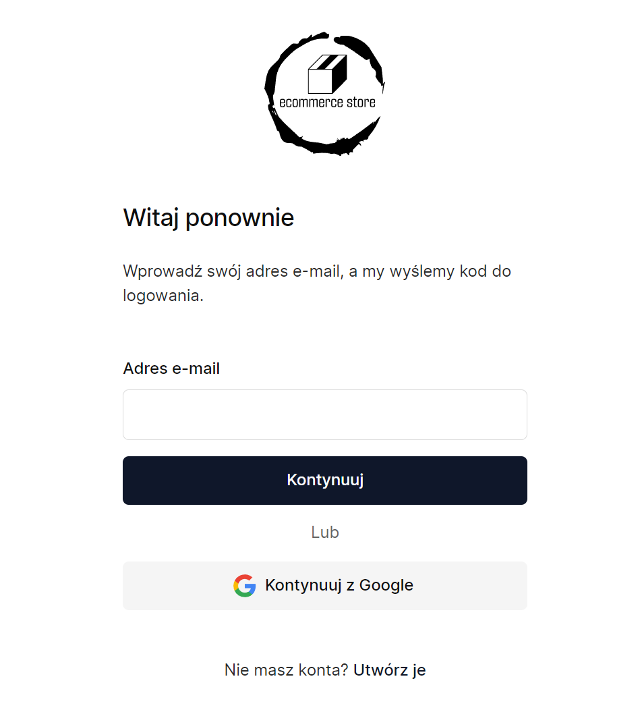

## Features

### Public Routes

1. **Home Page (`/`)**

   - Displays most popular and newest products

2. **Products Page (`/products`)**

   - All products with pagination
   - Display options: Card/List view
   - Sorting capabilities:
     - Alphabetical
     - Price
     - Date Added
   - Search functionality
   - Ascending/Descending options

   
   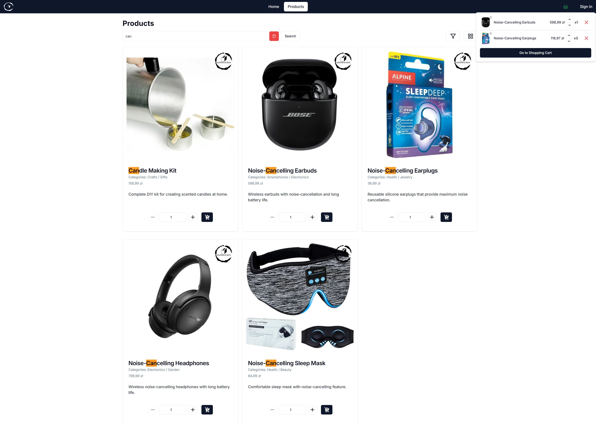

3. **Product Detail Page (`/products/:id`)**

   - Product image carousel (using `swiper`)
   - Detailed product description
   - Product specifications
   - Downloadable files:
     - Admin-uploaded file
     - Automatic PDF catalog

   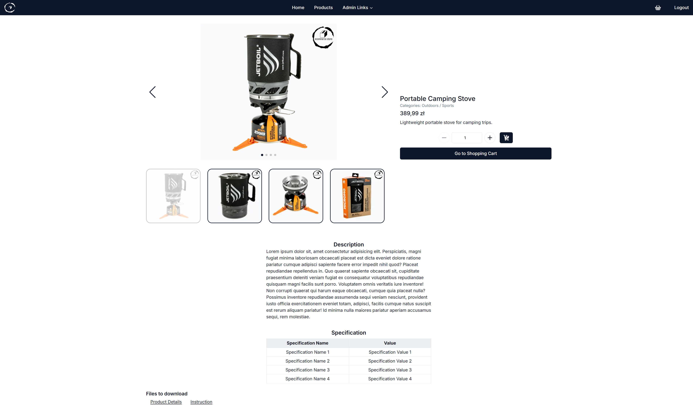

### User Routes (Authenticated)

1. **Order History (`/orders`)**

   - Complete order information
   - Order details: products, quantities, total amount
   - Discount information
   - Invoice/Receipt download options

   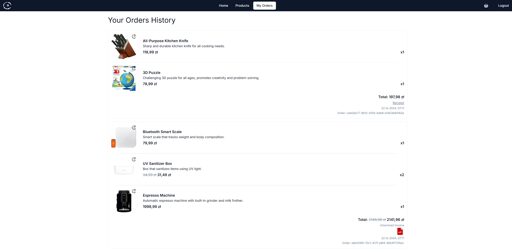

2. **Shopping Cart (`/purchase`)**

   - Cart item details
   - Quantity management
   - Discount code application
   - Invoice option

   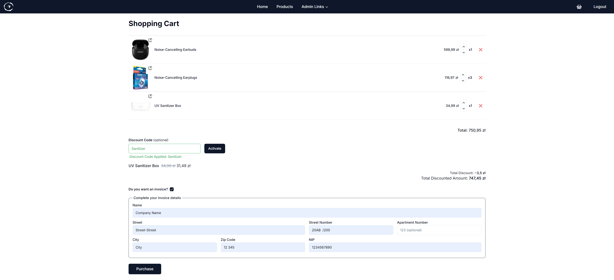

3. **Finalizing the transaction with `stripe`**

   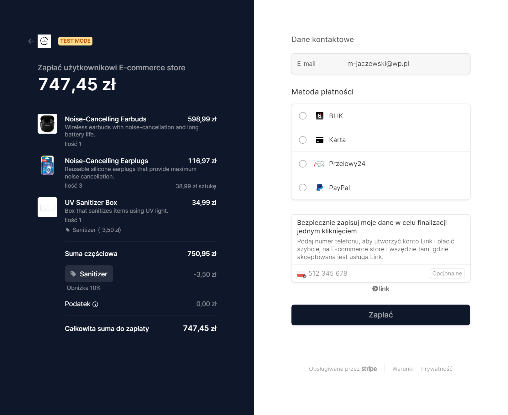
   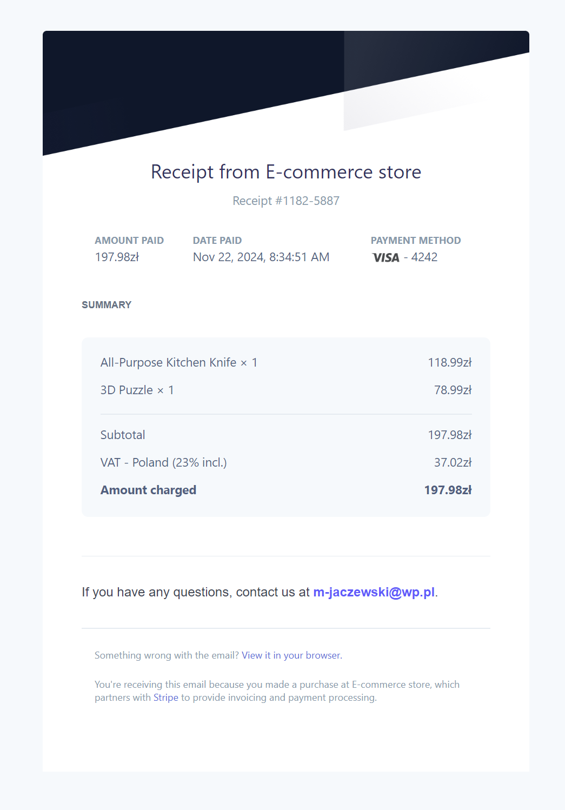
   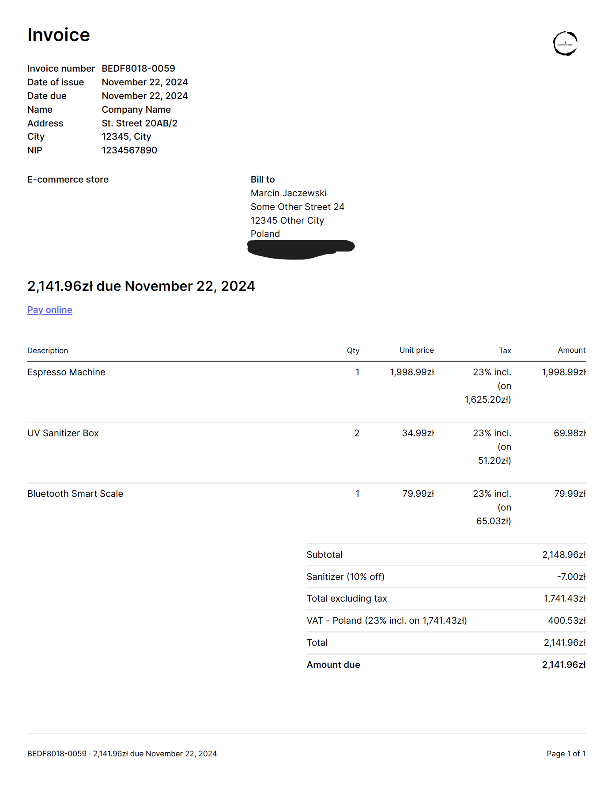

### Admin Routes

1. **Dashboard (`/admin`)**

   - Summary charts and analytics

   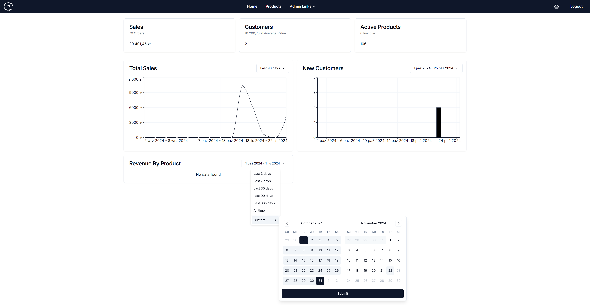

2. **Product Management (`/admin/products`)**

   - Product list
   - Activation/Deactivation
   - Filtering and sorting options
   - Downloadable product details
   - Product deletion

   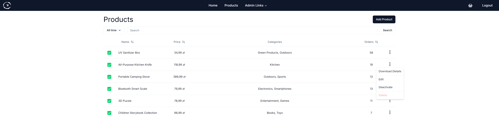

3. **Add/Edit Product (`/admin/new`, `/admin/products/:id`)**

   - Comprehensive product creation form
   - Fields: name, price, categories, description
   - File and image uploads

   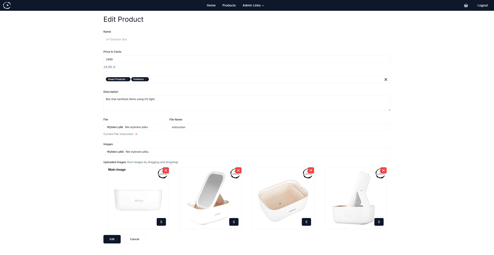

4. **Discount Codes Management**

   - Active and expired coupon sections
   - Filtering and sorting options

   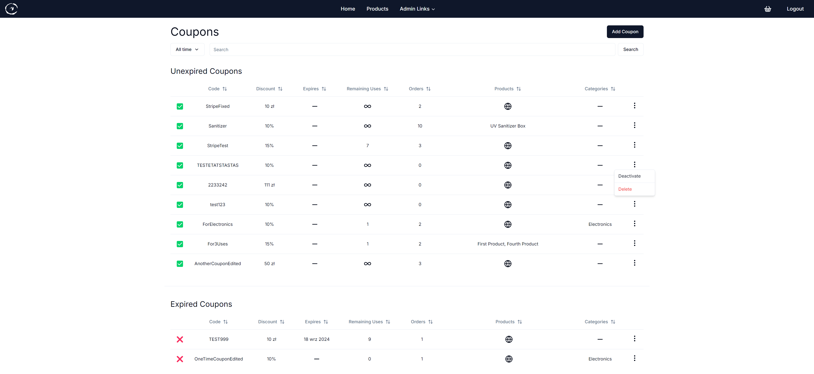

5. **Add Discount Code**

   - Coupon creation with flexible application rules

   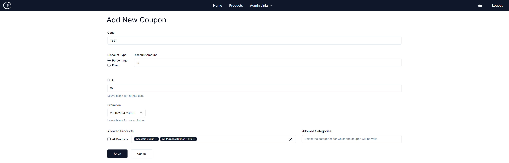

## Additional Screens

### Additional Important Interfaces

- **Admin Navbar Dropdown**

  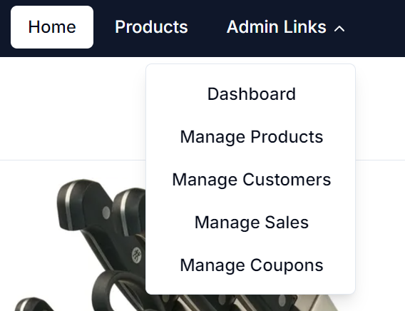

- **Order Confirmation Email**

  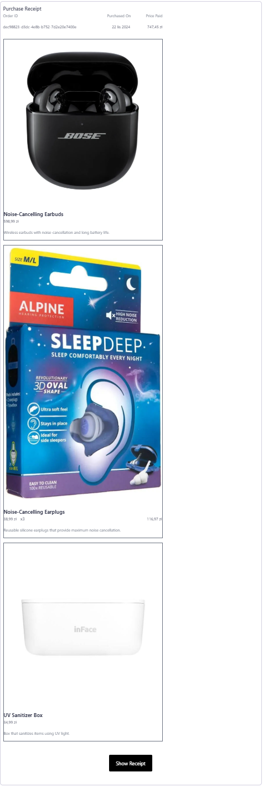
